# 💳 Credit Card Fraud Detection

> Detecting fraudulent credit card transactions using Machine Learning and Deep Learning on a highly imbalanced dataset (only 0.17% fraud).

Built with **scikit-learn** · **XGBoost** · **LightGBM** · **TensorFlow** · **SHAP** · **Optuna**
---

## 📊 The Problem: Extreme Class Imbalance

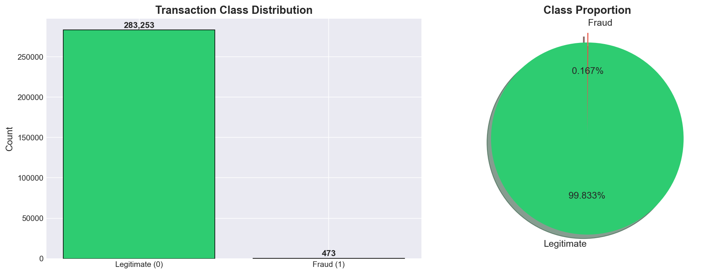

Out of **284,807 transactions**, only **492 are fraudulent (0.17%)**. A naive model predicting "not fraud" for everything would achieve 99.83% accuracy — but catch zero fraud. This project tackles that challenge head-on.

---

## 🏆 Results at a Glance

### Best Model: LightGBM (Tuned) — F1-Score: 0.859

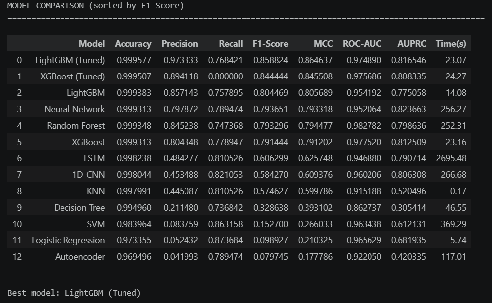

| Model | Accuracy | Precision | Recall | F1-Score | ROC-AUC |
|-------|----------|-----------|--------|----------|---------|
| **LightGBM (Tuned)** | 0.9996 | 0.9733 | 0.7684 | **0.8588** | 0.9749 |
| XGBoost (Tuned) | 0.9995 | 0.8941 | 0.8000 | 0.8444 | 0.9757 |
| LightGBM | 0.9994 | 0.8571 | 0.7579 | 0.8045 | 0.9542 |
| Neural Network (MLP) | 0.9993 | 0.7979 | 0.7895 | 0.7937 | 0.9521 |
| Random Forest | 0.9993 | 0.8452 | 0.7474 | 0.7933 | 0.9828 |

### Confusion Matrix

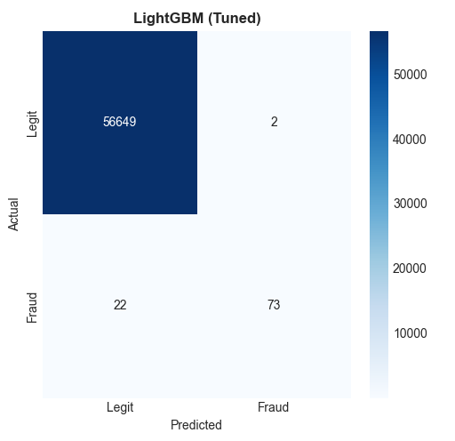

### ROC Curves — All 13 Models Compared

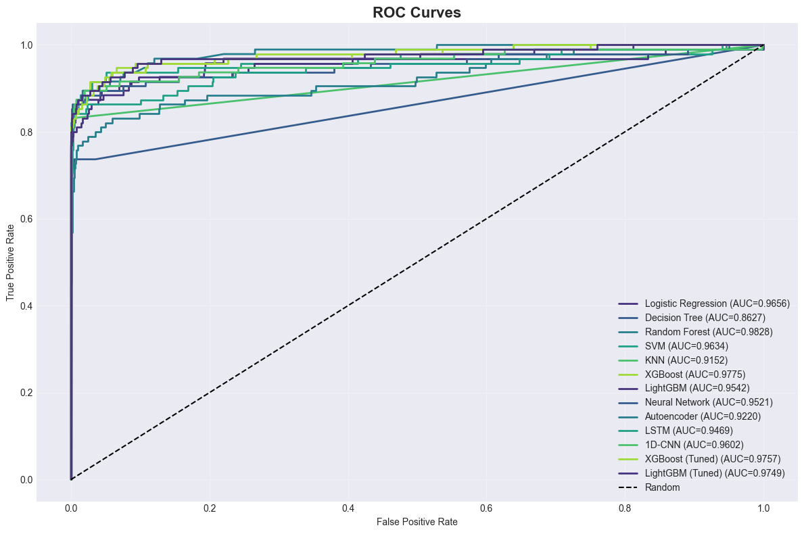

### Precision-Recall Curves

More informative than ROC for imbalanced datasets — shows the trade-off between catching fraud (recall) and not raising false alarms (precision).

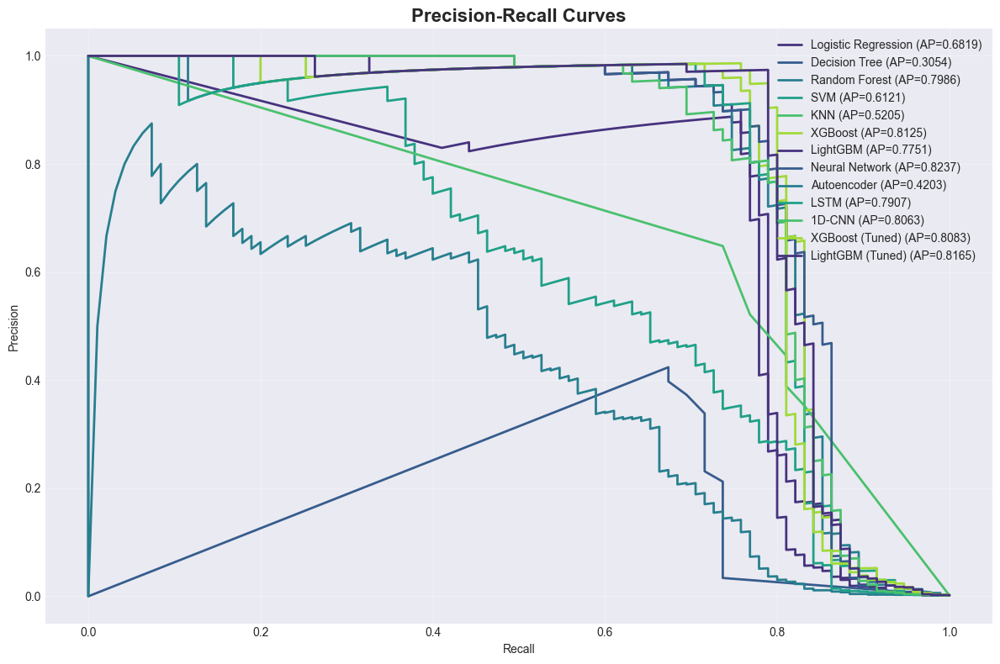

---

## 🔬 What I Did

### 1. Data Cleaning & EDA

- Checked for missing values, duplicates, and outliers
- Visualised class distribution, transaction amounts, and time patterns

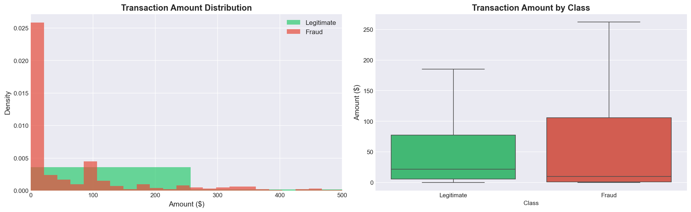

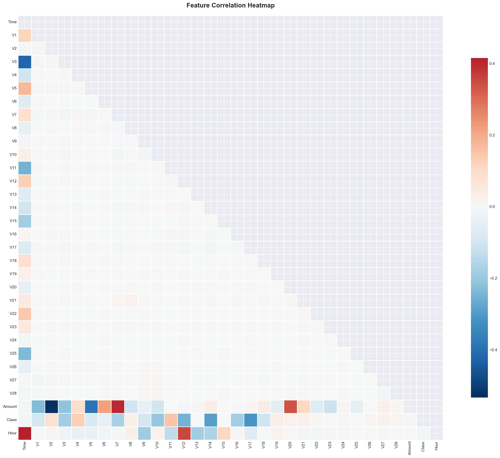

### 2. PCA Analysis

- Explored variance explained by each principal component
- Created 2D projections to visualise fraud vs legitimate clusters

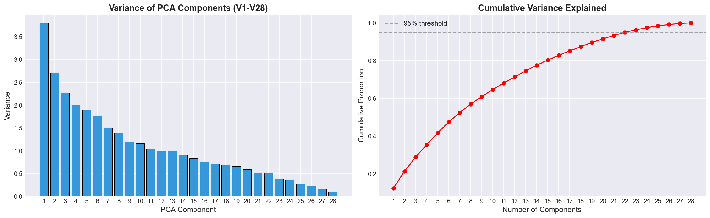

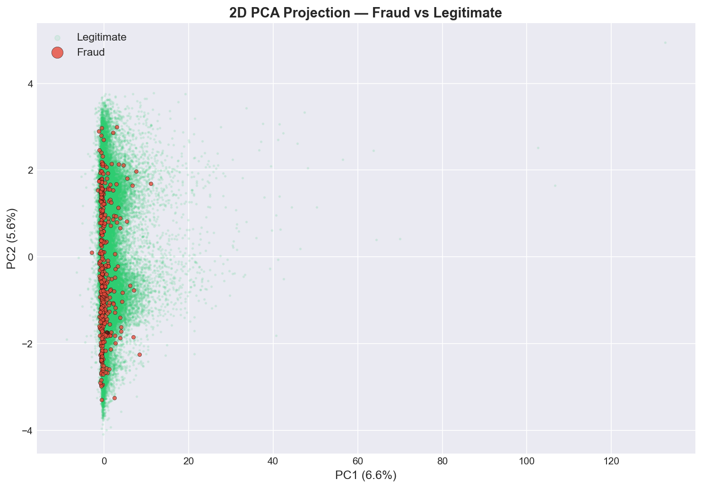

### 3. Feature Engineering

- Extracted **hour** from transaction time
- Applied **log-transformation** on Amount to reduce skewness

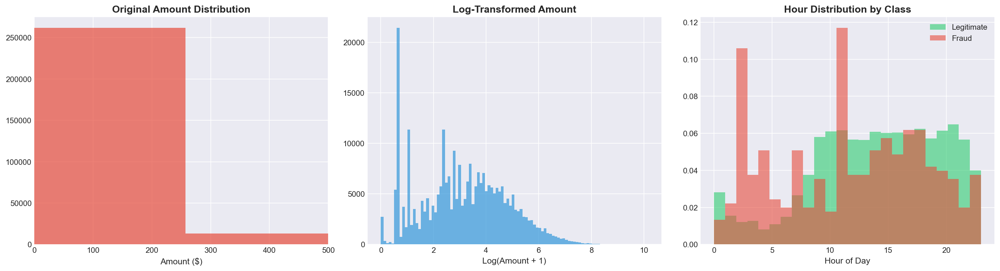

### 4. Handling Imbalance — SMOTE

- Applied SMOTE (Synthetic Minority Oversampling) on **training data only**
- Test data kept untouched to ensure honest evaluation
- This prevents **data leakage** — a common beginner mistake

### 5. Scaling

- StandardScaler fitted on training data only
- Prevents information from the test set leaking into the model

### 6. Unsupervised Analysis

- **K-Means Clustering** — explored natural groupings
- **DBSCAN** — density-based anomaly detection
- **Isolation Forest** — tree-based anomaly detection

### 7. Model Training — 11 Models Compared

**Classical ML:** Logistic Regression, Decision Tree, Random Forest, SVM, KNN

**Ensemble (Gradient Boosting):** XGBoost, LightGBM

**Deep Learning:** Neural Network (MLP), Autoencoder, LSTM, 1D-CNN

### 8. Hyperparameter Tuning

- Used **Optuna** for Bayesian optimization on XGBoost and LightGBM
- Tuned hyperparameters: learning rate, max depth, n_estimators, subsample, colsample

### 9. Explainability — SHAP

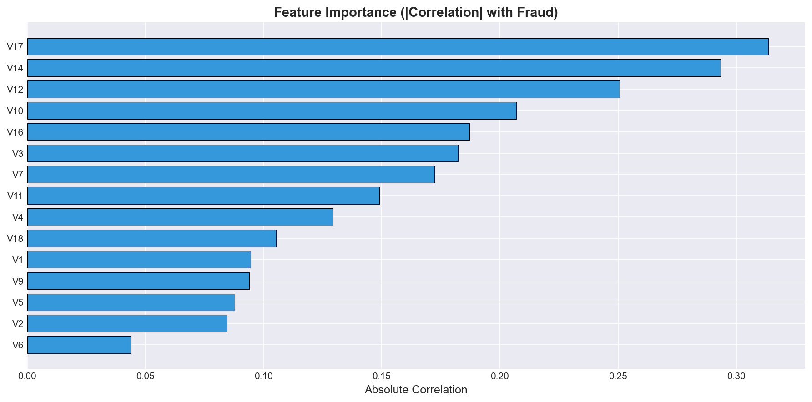

**Top predictive features:** V14, V4, and Amount_Log have the highest impact on fraud predictions. SHAP helps explain *why* a model makes certain decisions — critical for trust in financial applications.

---

## 📈 Distribution Analysis

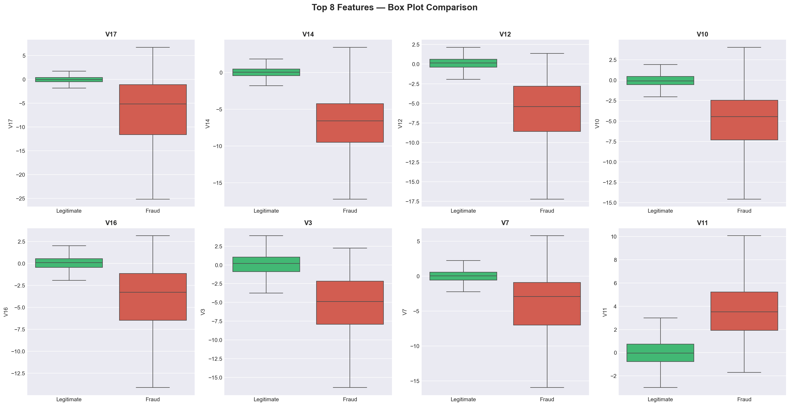

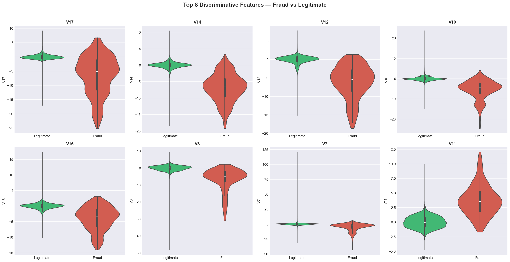

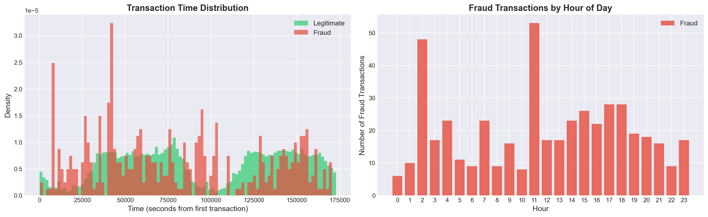

---

## 💡 Key Takeaways

- **Accuracy alone is misleading** — a model predicting "no fraud" gets 99.8% accuracy but catches nothing
- **Recall and F1-Score are more important** for fraud detection (missing a fraud is costlier than a false alarm)
- **SMOTE must only be applied to training data** to avoid data leakage
- **Ensemble methods (XGBoost, LightGBM) perform best** on tabular data after proper tuning
- **SHAP explainability** is essential for deploying models in regulated financial environments

---

## 🚀 How to Run

**Requires:** Python 3.10–3.12 (TensorFlow doesn't support 3.13+)

```bash
git clone https://github.com/rachananijalingappa/CreditCard_Fraud_Detection.git
cd CreditCard_Fraud_Detection
python -m venv venv
venv\Scripts\activate          # Windows
# source venv/bin/activate     # Mac/Linux
pip install -r requirements.txt
```

Download `creditcard.csv` from [Kaggle](https://www.kaggle.com/datasets/mlg-ulb/creditcardfraud) and place it in the `Data/` folder. Then open `credit_card_fraud_detection.ipynb` in Jupyter or VS Code.

## 📁 Project Structure

```
CreditCard_Fraud_Detection/
├── README.md
├── requirements.txt
├── .gitignore
├── credit_card_fraud_detection.ipynb   # Main notebook (imports from src/)
├── src/                                # Modular Python scripts
│   ├── __init__.py
│   ├── config.py                       # Constants and settings
│   ├── data_loader.py                  # Data loading and cleaning
│   ├── preprocessing.py                # Feature engineering, scaling, SMOTE
│   ├── visualization.py                # All EDA and result plots
│   ├── clustering.py                   # K-Means, DBSCAN, Isolation Forest
│   ├── models.py                       # Classical ML + Ensemble + Optuna
│   ├── deep_learning.py                # MLP, Autoencoder, LSTM, 1D-CNN
│   └── evaluation.py                   # Metrics, ROC/PR curves, SHAP
├── tests/                              # Unit tests
│   ├── __init__.py
│   └── test_preprocessing.py           # 17 tests for preprocessing pipeline
├── Data/                               # Dataset (not committed — download from Kaggle)
│   └── creditcard.csv
└── results/                            # All visualisations
    ├── class_distribution.png
    ├── amount_distribution.png
    ├── correlation_heatmap.png
    ├── box_plots.png
    ├── violin_plots.png
    ├── time_distribution.png
    ├── pca_variance.png
    ├── pca_2d.png
    ├── feature_engineering.png
    ├── confusion_matrix.png
    ├── roc_curve.png
    ├── pr_curve.png
    ├── model_comparison.png
    └── feature_importance.png
```

## 🛠️ Libraries

NumPy · Pandas · Matplotlib · Seaborn · Plotly · Scikit-learn · Imbalanced-learn · XGBoost · LightGBM · TensorFlow · Optuna · SHAP

## 📚 What I Learned

- End-to-end ML pipeline design for imbalanced classification
- Proper evaluation beyond accuracy (F1, AUC-ROC, AUPRC, MCC)
- Hyperparameter tuning with Bayesian optimization (Optuna)
- Model explainability with SHAP for financial applications
- Data leakage prevention (scaling & SMOTE on training data only)

## 📄 License

MIT

---

*Built by [Rachana Nijalingappa](https://github.com/rachananijalingappa)*
